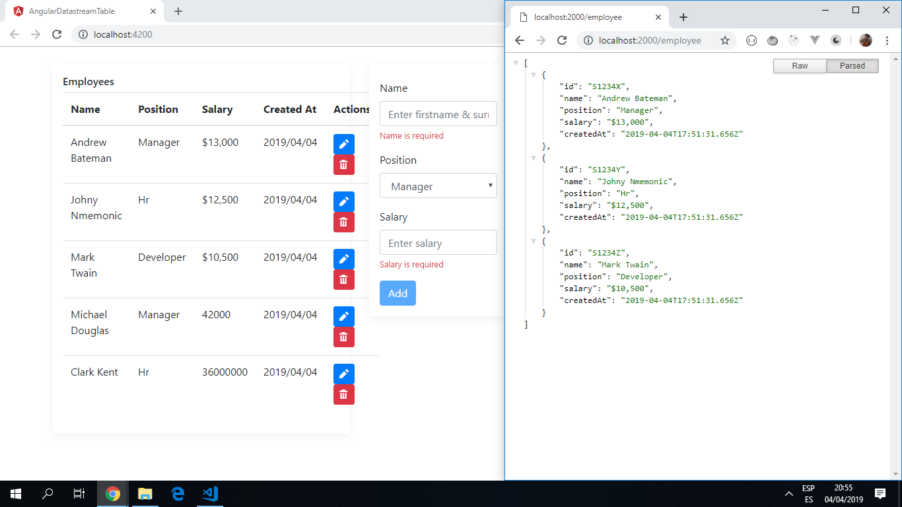

# Angular Datastream Table

App with realtime communication between app and server using a [Pusher](https://pusher.com/) channel for notifications/updates etc.

*** Note: to open web links in a new window use: _ctrl+click on link_**

## Table of contents

* [General info](#general-info)
* [Screenshots](#screenshots)
* [Technologies](#technologies)
* [Setup](#setup)
* [Features](#features)
* [Status](#status)
* [Inspiration](#inspiration)
* [Contact](#contact)

## General info

* The pusher channel uses a publish/subscribe model so all subscribers to the channel will receive the update. See [Pusher documentation](https://pusher.com/docs) for more information.

* The server.js file follows the [Twelve-Factor](https://12factor.net/) methodology for building software-as-a-service apps that:

'_Use declarative formats for setup automation, to minimize time and cost for new developers joining the project;
Have a clean contract with the underlying operating system, offering maximum portability between execution environments;
Are suitable for deployment on modern cloud platforms, obviating the need for servers and systems administration;
Minimize divergence between development and production, enabling continuous deployment for maximum agility;
And can scale up without significant changes to tooling, architecture, or development practices._'

## Screenshots



## Technologies

* generated with [Angular CLI v7.0.6](https://github.com/angular/angular-cli).

* Real-time communication scalable features added with [Pusher](https://pusher.com/)

## Setup

Run `ng serve` for a dev server. Navigate to `http://localhost:4200/`.

Run `node server.js` to run the server backend. Navigate to `http://localhost:2000/`.

Run `ng build` to build the project. The build artifacts will be stored in the `dist/` directory. Use the `--prod` flag for a production build.

Run `ng test` to execute the unit tests via [Karma](https://karma-runner.github.io).

Run `ng e2e` to execute the end-to-end tests via [Protractor](http://www.protractortest.org/).

## Code Examples

* Function to delete an employee record with alert message before using the '_actualDelete' function.

```typescript
  delete(employee: IEmployee) {
    // show delete confirmation with ngAlert
    this._ngAlert.push({
      message: `<strong>Are you sure!</strong> you want to delete this employee with name <strong>${employee.name}</strong>`,
      type: MessageType.warning,
      buttons: [
        {
          label: 'Continue',
          action: () => {
            this._actualDelete(employee);
          },
          css: 'btn btn-danger'
        }
      ]
    });
  }

```

## Features

* Forms created using [Angular's reactive forms](https://angular.io/api/forms/ReactiveFormsModule).

* Utility/helper classes used from [Bootstrap 4](https://getbootstrap.com/).

* real-time data and functionality using [Pusher event-based API 'Pusher Channel'](https://pusher.com/).

* working local server backend.

## Status & To-Do List

* Status: UI adds employees to the list without refreshing the browser (note: browser for server (port 2000) does have to be refreshed to show the changes).

* To-Do: Look at employee edit function. Customise app and add functionality. Consider currency pull-down menu for salary input.

## Inspiration

[Christian Nwamba's tutorial: BUILD A REALTIME TABLE WITH ANGULAR](https://pusher.com/tutorials/realtime-table-angular),

## Contact

Created by [ABateman](https://www.andrewbateman.org) - feel free to contact me!
